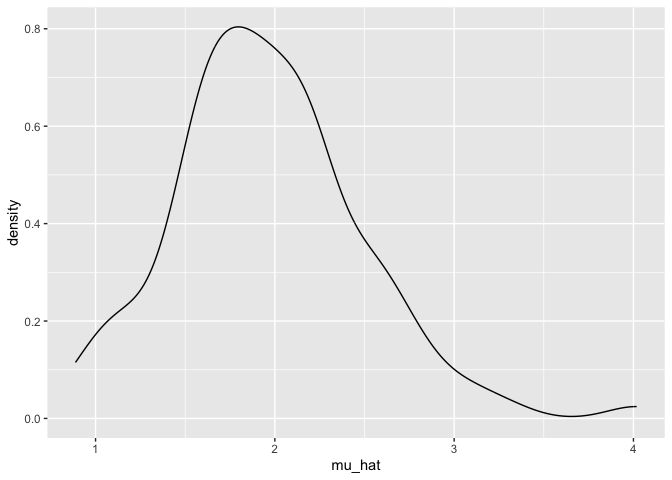
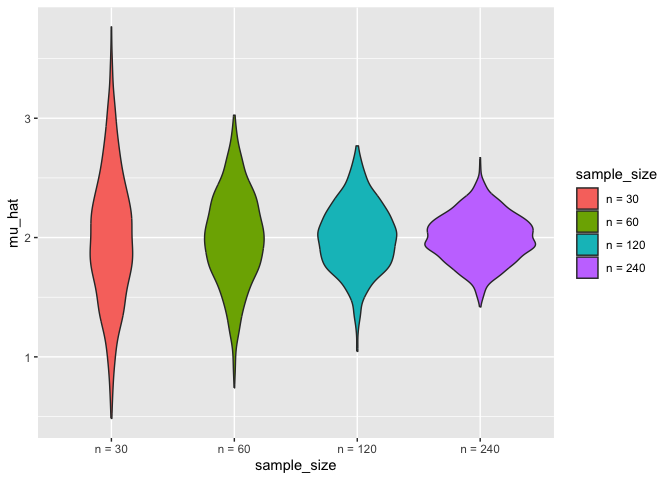
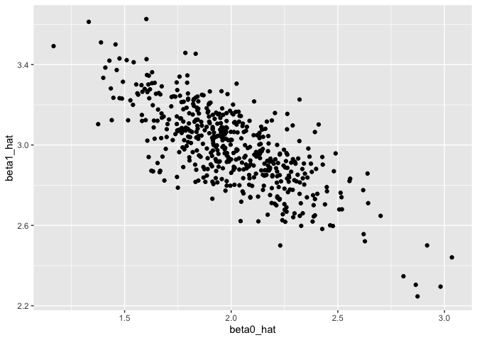
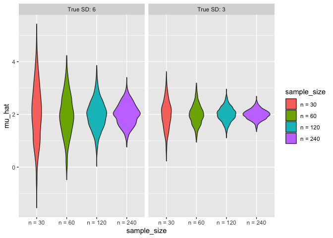

simulation
================
Shumei Liu
2024-11-14

``` r
library(tidyverse)
```

    ## ── Attaching core tidyverse packages ──────────────────────── tidyverse 2.0.0 ──
    ## ✔ dplyr     1.1.4     ✔ readr     2.1.5
    ## ✔ forcats   1.0.0     ✔ stringr   1.5.1
    ## ✔ ggplot2   3.5.1     ✔ tibble    3.2.1
    ## ✔ lubridate 1.9.3     ✔ tidyr     1.3.1
    ## ✔ purrr     1.0.2     
    ## ── Conflicts ────────────────────────────────────────── tidyverse_conflicts() ──
    ## ✖ dplyr::filter() masks stats::filter()
    ## ✖ dplyr::lag()    masks stats::lag()
    ## ℹ Use the conflicted package (<http://conflicted.r-lib.org/>) to force all conflicts to become errors

``` r
library(rvest)
```

    ## 
    ## Attaching package: 'rvest'
    ## 
    ## The following object is masked from 'package:readr':
    ## 
    ##     guess_encoding

``` r
set.seed(1) #keep one result
```

``` r
library(tidyverse)

knitr::opts_chunk$set(
  fig.width = 6,
  fig.asp = .6,
  out.width = "90%"
)

theme_set(theme_minimal() + theme(legend.position = "bottom"))

options(
  ggplot2.continuous.colour = "viridis",
  ggplot2.continuous.fill = "viridis"
)

scale_colour_discrete = scale_colour_viridis_d
scale_fill_discrete = scale_fill_viridis_d
```

## Simulation: Mean and SD for one 𝑛

``` r
sim_mean_sd = function(n, mu = 2, sigma = 3) {
  
  sim_data = tibble(
    x = rnorm(n, mean = mu, sd = sigma),
  )
  
  sim_data |> 
    summarize(
      mu_hat = mean(x),
      sigma_hat = sd(x)
    )
}
```

``` r
sim_mean_sd(30)
```

    ## # A tibble: 1 × 2
    ##   mu_hat sigma_hat
    ##    <dbl>     <dbl>
    ## 1   2.25      2.77

## simulate a lot

start with a for loop

``` r
output = vector("list", 100)

for (i in 1:100) {
  output[[i]] = sim_mean_sd(30)
}

sim_results = bind_rows(output)
```

Let’s use a loop function.

``` r
sim_results = 
  rerun(100, sim_mean_sd(30)) |>
  bind_rows()
```

    ## Warning: `rerun()` was deprecated in purrr 1.0.0.
    ## ℹ Please use `map()` instead.
    ##   # Previously
    ##   rerun(100, sim_mean_sd(30))
    ## 
    ##   # Now
    ##   map(1:100, ~ sim_mean_sd(30))
    ## This warning is displayed once every 8 hours.
    ## Call `lifecycle::last_lifecycle_warnings()` to see where this warning was
    ## generated.

``` r
sim_results_df = 
  expand_grid(
    sample_size = 30,
    iter = 1:100
  ) |> 
  mutate(
    estimate_df = map(sample_size, sim_mean_sd)
  ) |> 
  unnest(estimate_df)
```

Let’s look at results.

``` r
sim_results_df |> 
  ggplot(aes(x = mu_hat)) + 
  geom_density()
```

<!-- -->

``` r
sim_results_df |> 
  pivot_longer(
    mu_hat:sigma_hat,
    names_to = "parameter", 
    values_to = "estimate") |> 
  group_by(parameter) |> 
  summarize(
    emp_mean = mean(estimate),
    emp_sd = sd(estimate)) |> 
  knitr::kable(digits = 3)
```

| parameter | emp_mean | emp_sd |
|:----------|---------:|-------:|
| mu_hat    |    1.962 |  0.529 |
| sigma_hat |    3.014 |  0.408 |

``` r
sim_results_df =   
  map(1:100, \(i) sim_mean_sd(30, 2, 3)) |> 
  bind_rows()
```

just runs `sim_mean_sd(30, 2, 3)` without actually using `i`

## Simulation: Mean for several 𝑛s

``` r
sim_results_df = 
  expand_grid(
    sample_size = c(30, 60, 120, 240),
    iter = 1:1000
  ) |> 
  mutate(
    estimate_df = map(sample_size, sim_mean_sd)
  ) |> 
  unnest(estimate_df)

sim_results_df
```

    ## # A tibble: 4,000 × 4
    ##    sample_size  iter mu_hat sigma_hat
    ##          <dbl> <int>  <dbl>     <dbl>
    ##  1          30     1   1.88      3.69
    ##  2          30     2   2.13      2.91
    ##  3          30     3   1.64      2.74
    ##  4          30     4   2.19      2.78
    ##  5          30     5   1.74      2.82
    ##  6          30     6   1.42      3.05
    ##  7          30     7   2.16      2.39
    ##  8          30     8   1.20      2.04
    ##  9          30     9   2.03      3.03
    ## 10          30    10   1.91      2.93
    ## # ℹ 3,990 more rows

``` r
sim_results_df |> 
  mutate(
    sample_size = str_c("n = ", sample_size),
    sample_size = fct_inorder(sample_size)) |> 
  ggplot(aes(x = sample_size, y = mu_hat, fill = sample_size)) + 
  geom_violin()
```

<!-- -->

``` r
sim_results_df |> 
  pivot_longer(
    mu_hat:sigma_hat,
    names_to = "parameter", 
    values_to = "estimate") |> 
  group_by(parameter, sample_size) |> 
  summarize(
    emp_mean = mean(estimate),
    emp_var = var(estimate)) |> 
  knitr::kable(digits = 3)
```

    ## `summarise()` has grouped output by 'parameter'. You can override using the
    ## `.groups` argument.

| parameter | sample_size | emp_mean | emp_var |
|:----------|------------:|---------:|--------:|
| mu_hat    |          30 |    1.999 |   0.299 |
| mu_hat    |          60 |    1.996 |   0.149 |
| mu_hat    |         120 |    2.004 |   0.080 |
| mu_hat    |         240 |    1.998 |   0.039 |
| sigma_hat |          30 |    2.975 |   0.156 |
| sigma_hat |          60 |    3.002 |   0.073 |
| sigma_hat |         120 |    2.993 |   0.038 |
| sigma_hat |         240 |    2.994 |   0.020 |

## Simulation: SLR for one 𝑛

``` r
sim_regression = function(n, beta0 = 2, beta1 = 3) {
  
  sim_data = 
    tibble(
      x = rnorm(n, mean = 1, sd = 1),
      y = beta0 + beta1 * x + rnorm(n, 0, 1)
    )
  
  ls_fit = lm(y ~ x, data = sim_data)
  
  tibble(
    beta0_hat = coef(ls_fit)[1],
    beta1_hat = coef(ls_fit)[2]
  )
}

sim_regression(100)
```

    ## # A tibble: 1 × 2
    ##   beta0_hat beta1_hat
    ##       <dbl>     <dbl>
    ## 1      1.86      3.02

``` r
sim_results_df = 
  expand_grid(
    sample_size = 30,
    iter = 1:500
  ) |> 
  mutate(
    estimate_df = map(sample_size, sim_regression)
  ) |> 
  unnest(estimate_df)

sim_results_df
```

    ## # A tibble: 500 × 4
    ##    sample_size  iter beta0_hat beta1_hat
    ##          <dbl> <int>     <dbl>     <dbl>
    ##  1          30     1      2.26      2.89
    ##  2          30     2      2.00      2.93
    ##  3          30     3      2.22      2.87
    ##  4          30     4      1.97      3.08
    ##  5          30     5      2.92      2.50
    ##  6          30     6      1.86      3.05
    ##  7          30     7      1.94      2.89
    ##  8          30     8      1.90      3.21
    ##  9          30     9      2.43      2.90
    ## 10          30    10      2.17      3.04
    ## # ℹ 490 more rows

``` r
sim_results_df |> 
  ggplot(aes(x = beta0_hat, y = beta1_hat)) + 
  geom_point()
```

<!-- -->

## Varying two simulation parameters

``` r
sim_results_df = 
  expand_grid(
    sample_size = c(30, 60, 120, 240),
    true_sd = c(6, 3),
    iter = 1:1000
  ) |> 
  mutate(
    estimate_df = 
      map2(sample_size, true_sd, \(n, sd) sim_mean_sd(n = n, sigma = sd))
  ) |> 
  unnest(estimate_df)

sim_results_df
```

    ## # A tibble: 8,000 × 5
    ##    sample_size true_sd  iter mu_hat sigma_hat
    ##          <dbl>   <dbl> <int>  <dbl>     <dbl>
    ##  1          30       6     1  3.94       5.55
    ##  2          30       6     2  1.77       5.73
    ##  3          30       6     3  1.39       6.89
    ##  4          30       6     4  2.52       4.48
    ##  5          30       6     5  3.21       5.04
    ##  6          30       6     6  1.90       6.22
    ##  7          30       6     7  2.36       4.54
    ##  8          30       6     8  0.501      7.23
    ##  9          30       6     9  1.77       5.76
    ## 10          30       6    10  1.22       6.41
    ## # ℹ 7,990 more rows

``` r
sim_results_df |> 
  mutate(
    true_sd = str_c("True SD: ", true_sd),
    true_sd = fct_inorder(true_sd),
    sample_size = str_c("n = ", sample_size),
    sample_size = fct_inorder(sample_size)) |> 
  ggplot(aes(x = sample_size, y = mu_hat, fill = sample_size)) + 
  geom_violin() + 
  facet_grid(. ~ true_sd)
```

<!-- -->
